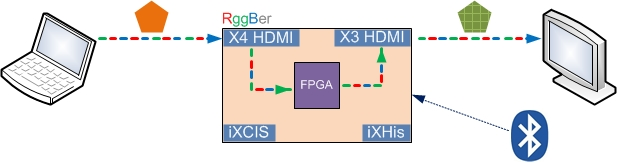

### Introduction

This is FPGA project for video processing unit applications.

In current rev.3 hardware, user still needs [MCU project](https://github.com/rggber/rggber-mcu-prj) for configurations and wireless control. But in rev.4 which will be deliverable version, both MCU and FPGA can do all of those.

### Diagram

